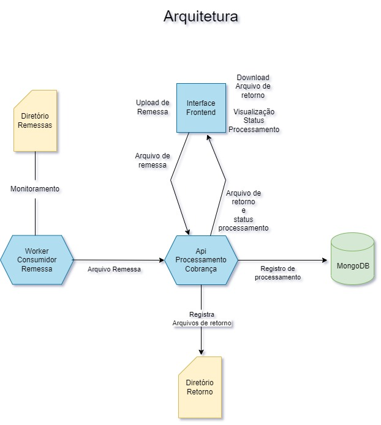

# Api De Cobrança

Esta é a API principal para o processamento de Remessa e a criação das cobranças e QRCode. A API recebe requisições
tanto da Interface FrontEnd pelo usuário, quanto do [worker](https://github.com/GustavoAV2/ShipmentFileProcessor) que está monitorando o diretório de arquivos de remessa.
A API tem a responsabilidade de interpretar os arquivos, gerar o QRCode de cobrança e criar as respostas correspondentes no formato do arquivo de retorno CNAB 750. Após o processamento, o arquivo de retorno é salvo em um diretório de saída.

## Fluxograma
⠀⠀⠀⠀⠀⠀⠀⠀⠀⠀⠀⠀⠀⠀⠀⠀⠀⠀⠀⠀⠀⠀⠀⠀⠀⠀⠀⠀⠀⠀⠀⠀⠀⠀⠀⠀⠀⠀⠀⠀⠀


## Arquitetura da API em comunicação com os outros projetos
⠀⠀⠀⠀⠀⠀⠀⠀⠀⠀⠀⠀⠀⠀⠀⠀⠀⠀⠀⠀⠀⠀⠀⠀⠀⠀⠀⠀⠀⠀⠀⠀⠀⠀⠀⠀⠀⠀⠀⠀⠀


## Instalação

1. Certifique-se de ter o Python 3.11 instalado em seu sistema.
   [Download Pyhon](https://www.python.org/downloads/release/python-3114/)
3. Clone este repositório em sua máquina local.
4. Navegue até o diretório do projeto:
   ```
   cd ApiShipmentIntegration
   ```
5. Crie um ambiente virtual (opcional, mas recomendado):
   ```
   python -m venv venv
   ```
6. Ative o ambiente virtual:
   - Windows:
     ```
     venv\Scripts\activate
     ```
   - Linux/Mac:
     ```
     source venv/bin/activate
     ```
7. Instale as dependências do projeto:
   ```
   pip install -r requirements.txt
   ```

## Execução

1. Certifique-se de que o ambiente virtual está ativado (veja o passo 5 da seção de instalação).
2. Execute o comando a seguir para iniciar o monitoramento do diretório:
   ```
   python main.py
   ```

## Licença

Este projeto está licenciado sob a [MIT License](LICENSE).
